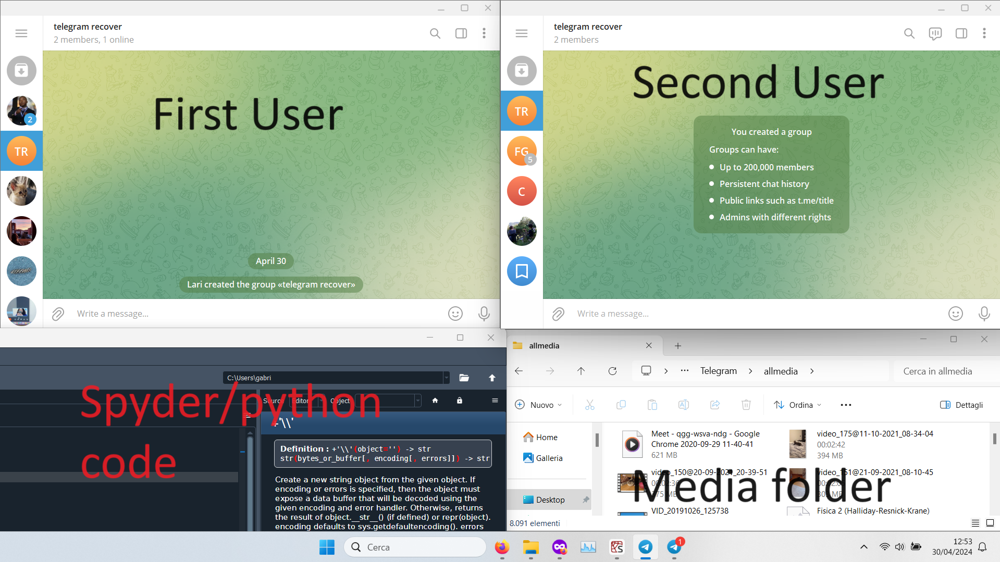

#Telegram chat restorer pyautogui version

Bonjour tout-le-monde! This project allows you to import your previously exported telegram chat into your telegram app.
This method works. It's slow, as I will say later, and it works using the pyautogui library, which that means that your computer will be not usable for some time.
This app works without using telegram bots. The messages will be recovered by re-sending them in real time in the chat.

You have two pieces of code in this repository:
html_to_text_pyautogui.py
and
pyautogui_recover.py

The first one allows you to convert an HTML telegram back up into a whatsapp text version.
The second one allows you to parse those whatsapp texts, you have previously created, and automating the process of sending messages, media (I haven't tried stickers, which I didn't have) from the two users.

## How to use?

1. <ins>From telegram format to whatsapp text format</ins>
The first thing you have to do is to convert your telegram chat backup into the Whatsapp text format. There are several application in github you can use to do that.
If you have like me a Telegram back up in html format, you can use html_to_txt_pyautogui.py and follow the instructions.
Mine html files are called ...messages, ...messages1.

Once the code has run, you will have in your user folder some files called _chat1, _chat2...

2. <ins>Modify directories in pyautogui_recover</ins>
Create the allmedia folder in which you have to put all the media that were in the telegram back up.
You have to change the path of some directories in the code. Those paths are highlighted by the comment '''IMPORTANT'''.
I suggest to cancel those comments after replacing those paths.

3. <ins>Set up your desktop</ins>
The application use pyautogui to send the messages. In order to do so it clicks and move in your desktop like a human user would do.
Before running the app you have to set up your desktop.
This code works for two users only. But if you want to it's easy to change the code and set it for multiple users, like a group.
First thing you have to install multiple telegram desktop app. Do not use browsers, because it will use too much RAM and it will give errors.
In this link there is a tutorial in order to do so:
https://youtu.be/sw1mRJQi7nM?feature=shared

Once you have installed twice the app you have to connect in both of them with the two different users.
If you have privacy issues, you can create new accounts with other phone numbers.
I suggest to create a group for both users if you intend to use the direct chat while the app is running or if you don't want to have the older messages in front of
the newer messages if you have already started a new chat.

You have to set up your desktop like this:

At the two top edges there are the two telegram apps. If you drag them to the top and then to the left/right, windows will automatically put them in position.
Open the two chat where you want to send the messages, if you have created a specific group for this istance, open the group for both the users.
At the bottom right there is the allmedia folder. Set the folder with View Option in Content.
At the bottom left there is the python program that in the next step you will have to run with shift+enter.
Pyautogui works by moving the mouse from telegram app to the other, and by researching and draggind the media from the allmedia folder.
 

:warning:**!!!IMPORTANT!!!**:warning:

If something happens that you don't want to happen, just move your mouse to the TOP LEFT edge, and the code will stop running.

If you see that the mouse doesn't click what it should have clicked, you probabily have to re-set the positions of the command of pyautogui.
Here it is the documentation https://pyautogui.readthedocs.io/en/latest/index.html, if you have to change the code.

4. <ins>Run the code</ins>
Before running the code press block num (you shouldn't be able to type any number).
Once you have all prepared, click on the python code and run it by pressing the hotkey shift+enter.
As I said before if something goes wrong move your mouse to the **TOP LEFT edge**.

5. <ins>BUGS</ins>
It could happen sometimes that the code will run into some errors.
I suggest to always monitor that the backing up is working.
Here are two most common errors that will occurr.

:warning: Remember to press Num Lock.
Pyautogui will use a hotkey to make the format of date and time, and Num Lock has to be press to avoid typing numbers.

:warning: Opening a document or a folder. 
Sometimes the media that the app has to drag into the chat is a compress folder or a document.
The app could rarely double click and open the document or the folder.
I think the problem is in this lines of codes, in the definition of the function search_for_media:
57    time.sleep(1)
58    pyautogui.moveTo(x=1716, y=855)
59    pyautogui.click()
60    time.sleep(0.7)

I haven't find a correction since it worked fine at the end for me.

:warning: Hardware problems.
The code worked on my Windows 11, 8 gb ram, ssd laptop with fiber optic internet connection.
If you see that the code isn't working for you could it be a time issue.
In pyautogui_recover change time.sleep() with the time that works on your computer.
I put a sleeping time of 2 minutes for those media bigger than 8Mb, but you can change it.

You can also have problems by using a different OS. If it is so you have to change the positions of the pyautogui functions (search bar, writing bar..)
in pyautogui_recover.py . To find the new locations use pyautogui.position() (more information in https://pyautogui.readthedocs.io/en/latest/index.html).

🕑 Time
This app takes a long time to work.
I had 256 messages.html files and it ended after 5 days, non stop.
I have calculated that on average pyautigui_recover.py will send a message every two seconds.
Calculate the time that you will need before using the application.
The computer will be unusable for a long time.

## Credits
This project wouldn't be possible without Suberbia work on html_to_txt.
And the inspiration from TLIMPORTER by ferfega.
